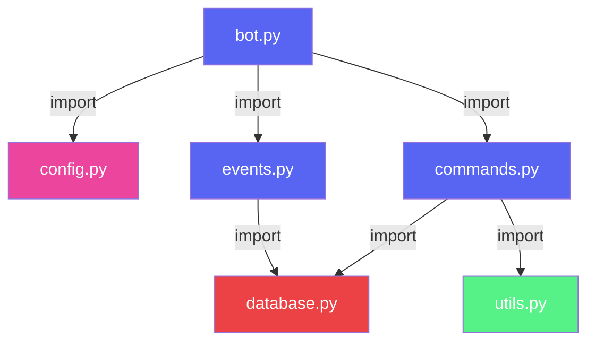
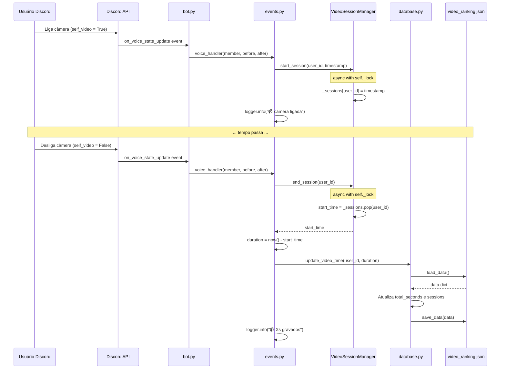
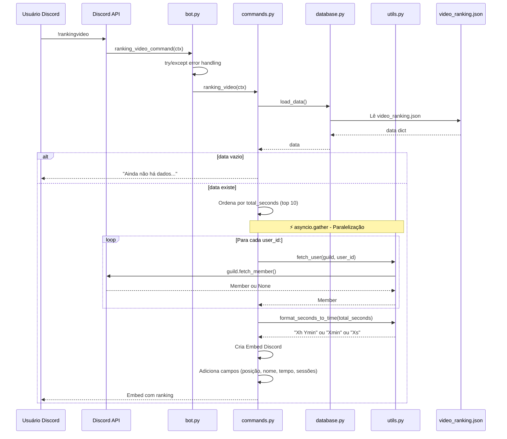
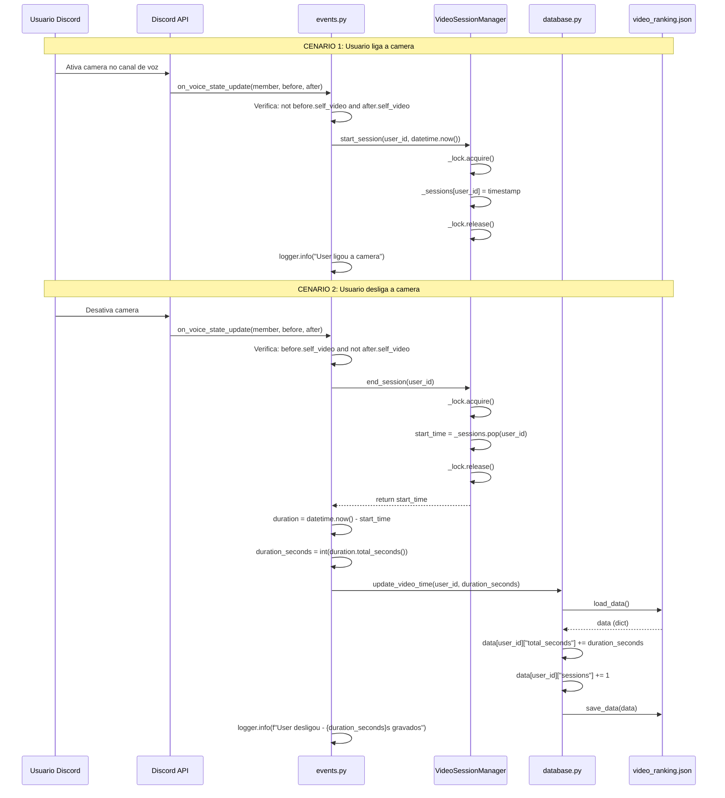
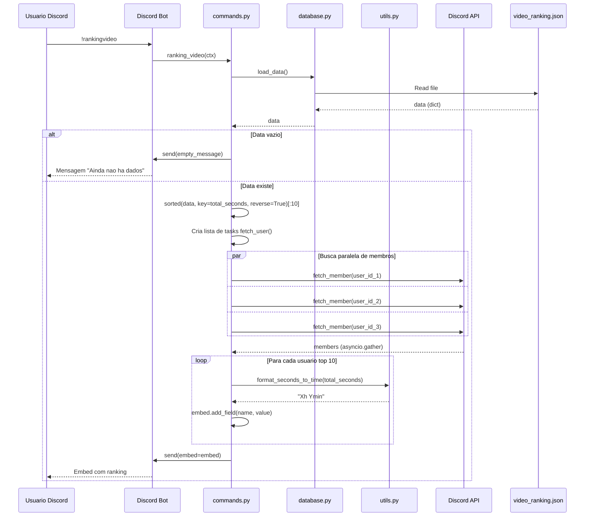
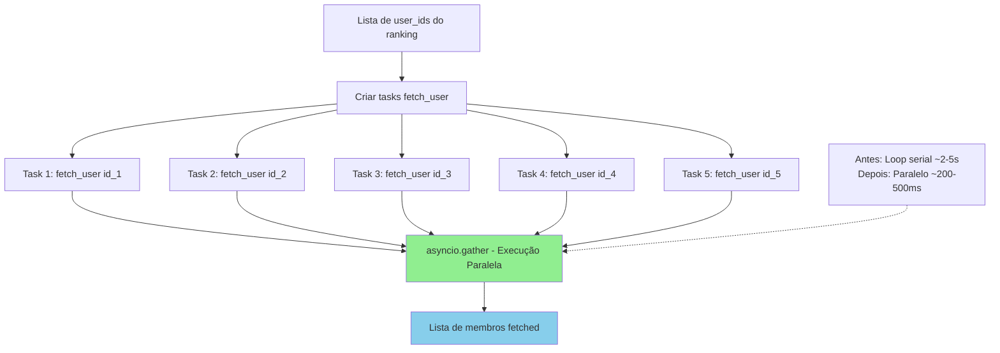
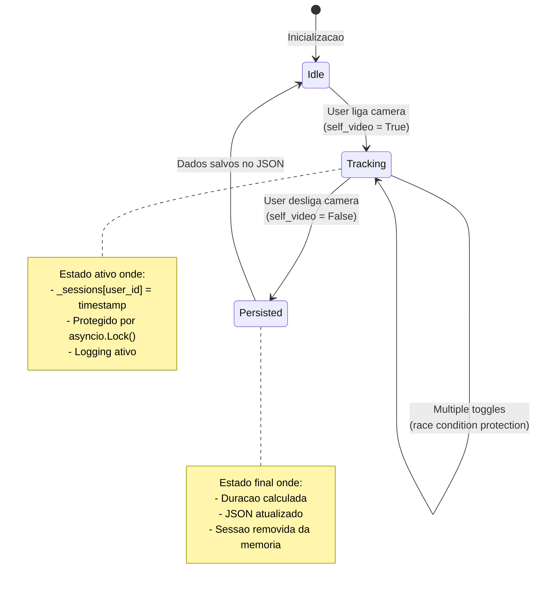

# Arquitetura - Bate-Ponto Discord Bot

## 1. Visão Geral

O Bate-Ponto é um bot Discord para rastreamento de atividade de membros com foco em tempo de câmera ligada em canais de voz. A arquitetura foi projetada para servidores com até 50 usuários ativos, utilizando Python 3.10+ e discord.py 2.x.

### 1.1 Stack Tecnológico

- **Linguagem**: Python 3.10+
- **Biblioteca Discord**: discord.py 2.3+
- **Persistência**: JSON (biblioteca nativa `json`)
- **Gestão de tempo**: `datetime` (biblioteca nativa)
- **Deploy**: VPS Ubuntu 22.04+ ou container Docker

## 2. Estrutura de Arquivos

```
bate-ponto/
├── bot.py              # Ponto de entrada principal
├── config.py           # Configurações e constantes
├── database.py         # Funções de persistência JSON
├── commands.py         # Comandos do bot (!rankingvideo)
├── events.py           # Event handlers (voice state)
├── utils.py            # Funções auxiliares
├── .env                # Variáveis de ambiente
├── requirements.txt    # Dependências
├── video_ranking.json  # Dados (gerado automaticamente)
├── tests/              # Testes automatizados
├── docs/               # Documentação técnica
└── README.md           # Documentação de usuário
```

## 2.1 Interações Entre Componentes

Esta seção detalha o fluxo de comunicação entre os 6 módulos Python que compõem o sistema.

### 2.1.1 Mapeamento de Dependências



**Legenda**:
- 🔵 Azul: Módulos principais (bot, events, commands)
- 🔴 Vermelho: Persistência de dados (database)
- 🟢 Verde: Utilitários (utils, config)
- 🟣 Rosa: Configuração (config)

### 2.1.2 Fluxo de Eventos - Voice State Update

O fluxo abaixo descreve o que acontece quando um usuário liga/desliga a câmera:



#### VideoSessionManager: Gerenciamento de Estado com asyncio.Lock()

O `VideoSessionManager` em `events.py` gerencia o estado de sessões de vídeo com proteção de concorrência:

```python
class VideoSessionManager:
    def __init__(self):
        self._sessions: Dict[str, datetime] = {}
        self._lock = asyncio.Lock()  # 🔒 Proteção contra race conditions

    async def start_session(self, user_id: str, timestamp: datetime) -> None:
        async with self._lock:  # ⚡ Thread-safe
            self._sessions[user_id] = timestamp

    async def end_session(self, user_id: str) -> Optional[datetime]:
        async with self._lock:  # ⚡ Thread-safe
            return self._sessions.pop(user_id, None)
```

**Por que asyncio.Lock()?**
- Previne race conditions quando múltiplos usuários ligam/desligam câmera simultaneamente
- Garante operações atômicas no dict `_sessions`
- Implementado na Fase 1 para resolver bugs de concorrência

### 2.1.3 Fluxo de Comandos - !rankingvideo

O fluxo abaixo descreve o que acontece quando um usuário solicita o ranking:



#### Paralelização com asyncio.gather()

O comando `rankingvideo` usa `asyncio.gather()` para buscar informações de múltiplos usuários em paralelo:

```python
# Antes (serial): 2-5 segundos para 10 usuários
for user_id, _ in sorted_users:
    member = await fetch_user(guild, user_id)  # Bloqueia

# Depois (paralelo): 200-500ms para 10 usuários
member_tasks = [
    fetch_user(guild, user_id)
    for user_id, _ in sorted_users[:MAX_RANKING_SIZE]
]
members = await asyncio.gather(*member_tasks, return_exceptions=True)
```

**Benefício**: ~10x mais rápido
**Implementado**: Fase 1 - Task 2

### 2.1.4 Sequência de Chamadas - Detalhada

#### Quando um usuário liga a câmera:

1. **Discord API** → `bot.py:on_voice_state_update()`
2. **bot.py** → `events.py:on_voice_state_update()` [import dinâmico]
3. **events.py** → `VideoSessionManager.start_session()`
4. **VideoSessionManager** → Armazena `user_id: datetime` em `_sessions`
5. **events.py** → `logger.info()` para debug

#### Quando um usuário desliga a câmera:

1. **Discord API** → `bot.py:on_voice_state_update()`
2. **bot.py** → `events.py:on_voice_state_update()` [import dinâmico]
3. **events.py** → `VideoSessionManager.end_session()`
4. **VideoSessionManager** → Remove e retorna `datetime` de `_sessions`
5. **events.py** → Calcula `duration = now() - start_time`
6. **events.py** → `database.py:update_video_time(user_id, duration)`
7. **database.py** → `load_data()` → `video_ranking.json`
8. **database.py** → Atualiza `total_seconds` e `sessions`
9. **database.py** → `save_data()` → `video_ranking.json`
10. **events.py** → `logger.info()` para debug

#### Quando um usuário executa !rankingvideo:

1. **Discord API** → `bot.py:ranking_video_command()`
2. **bot.py** → `commands.py:ranking_video()` [import dinâmico]
3. **commands.py** → `database.py:load_data()`
4. **database.py** → Lê `video_ranking.json`
5. **commands.py** → Ordena dados por `total_seconds`
6. **commands.py** → `asyncio.gather([utils.fetch_user(...) for ...])`
7. **utils.py** → `Discord API:guild.fetch_member()` [paralelo]
8. **commands.py** → `utils.py:format_seconds_to_time()`
9. **utils.py** → Retorna string formatada
10. **commands.py** → Cria `discord.Embed` com campos
11. **commands.py** → `ctx.send(embed=...)`

### 2.1.5 Tratamento de Erros em Camadas

O sistema possui múltiplas camadas de tratamento de erros:

**Camada 1: bot.py (Entry Point)**
```python
@bot.event
async def on_voice_state_update(member, before, after):
    try:
        from events import on_voice_state_update as voice_handler
        await voice_handler(member, before, after)
    except ImportError:
        logger.warning('Módulo events.py não encontrado.')
    except Exception as e:
        logger.error(f'Erro no handler: {e}', exc_info=True)
```

**Camada 2: on_command_error**
```python
@bot.event
async def on_command_error(ctx, error):
    if isinstance(error, commands.CommandNotFound):
        return  # Ignora silenciosamente
    if isinstance(error, commands.MissingRequiredArgument):
        await ctx.send(f'Argumento faltando: {error.param.name}')
    logger.error(f'Erro no comando: {error}', exc_info=True)
```

**Camada 3: Funções utilitárias**
```python
async def fetch_user(guild, user_id) -> Optional[discord.Member]:
    try:
        return await guild.fetch_member(user_id)
    except (discord.NotFound, discord.HTTPException):
        return None  # Tratamento silencioso
```

---

## 3. Componentes Principais

### 3.1 Event Handler - Voice State
**Localização**: `events.py`

Detecta mudanças em `self_video` do Discord:
- Registra timestamps quando câmera é ligada
- Calcula duração quando câmera é desligada
- Atualiza JSON ao final de cada sessão

### 3.2 Data Manager
**Localização**: `database.py`

Funções de persistência:
- `load_data()`: Carrega dados do JSON
- `save_data()`: Salva dados no JSON
- `update_video_time()`: Atualiza tempo acumulado

### 3.3 Command Handler
**Localização**: `commands.py`

- `ranking_video()`: Exibe top 10 usuários por tempo de câmera
- Formatação em embed Discord com estilização

## 4. Intents Necessários

```python
intents = discord.Intents.default()
intents.guilds = True
intents.voice_states = True
intents.members = True  # Para fetch_user
```

## 5. Restrições e Limitações

### 5.1 Limitações Atuais Conhecidas

#### 5.1.1 Escalabilidade - JSON (RNF02)
**Status**: Limitação de Arquitetura

O uso de JSON como mecanismo de persistência impõe limites físicos de escalabilidade:

- **Capacidade Máxima**: ~50-100 usuários
- **Tamanho do Arquivo**: < 10KB para 50 usuários (conforme RNF02)
- **Operações**: Read/Write em arquivo único (sem otimização de concorrência)

**Impacto**:
- Degradação de performance acima de 100 usuários
- Tempo de resposta aumenta linearmente com o tamanho do JSON
- Race conditions em cenários de alta concorrência

**Solução Planejada**: Migração para SQLite (Fase 2) ou PostgreSQL (Fase 3)

#### 5.1.2 Perda de Sessões Ativas em Restart (UC04)
**Status**: Limitação Conhecida (PRD UC04)

Sessões de câmera ativas não persistem entre reinícios do bot:

- **Causa**: `active_video_sessions` é um dicionário em memória
- **Impacto**: Tempo de câmera durante o restart não é contabilizado
- **Cenário**: Bot crasha ou é reiniciado enquanto usuários estão com câmera ligada

**Comportamento Atual**:
```python
active_video_sessions = {
  "user_id": datetime_object  # Perdido em restart
}
```

**Solução Planejada**:
- Fase 2: Persistência periódica de sessões ativas em JSON
- Fase 3: Sessões ativas em banco de dados

#### 5.1.3 Multi-Guild não Suportado
**Status**: Limitação de Escopo

O bot foi projetado para operar em um único servidor Discord (guild):

- **Hardcoded Single Guild**: Sem suporte a múltiplos servidores
- **Isolamento de Dados**: `video_ranking.json` é global para todos os servidores
- **Impacto**: Rankings misturam dados de diferentes servidores

**Requisito para Multi-Guild**:
- Mudança para estrutura de dados hierárquica
- Necessidade de identificação de guild em todas as operações
- Separação de rankings por servidor

#### 5.1.4 Ausência de File Locking em database.py
**Status**: Limitação de Concorrência

O módulo `database.py` não implementa mecanismos de controle de concorrência:

- **Sem File Lock**: Múltiplas escritas podem corromper o JSON
- **Race Conditions**: `load_data()` → `modify` → `save_data()` não é atômico
- **Risco**: Perda de dados em cenários de alta concorrência

**Exemplo de Cenário Problemático**:
```python
# Thread 1
data = load_data()  # Lê versão A
data[user]["total_seconds"] += duration
save_data(data)  # Escreve versão B

# Thread 2 (simultâneo)
data = load_data()  # Lê versão A (sobrescreve B!)
data[user]["total_seconds"] += duration2
save_data(data)  # Escreve versão C (perde dados da thread 1)
```

**Solução Planejada**:
- Fase 2: Implementar file locking com `fcntl` ou `portalocker`
- Fase 3: Migração para banco de dados com ACID (SQLite/PostgreSQL)

#### 5.1.5 Ausência de Cooldown em Comandos
**Status**: Limitação de Segurança

Comandos do bot não possuem cooldown implementado:

- **Vulnerabilidade**: Usuários podem spammar comandos
- **Risco**: Sobrecarga do bot e degradação de serviço
- **Impacto**: Possível DoS (Denial of Service) por spam de `!rankingvideo`

**Solução Planejada**: Implementar cooldown via `commands.CooldownMapping` (Fase 2)

#### 5.1.6 Teto de Performance com fetch_user
**Status**: Limitação de Performance

Mesmo com paralelização, o uso de `fetch_user()` impõe limites:

- **Bottleneck**: Discord API rate limits
- **Latência**: Cada fetch é uma chamada de API externa
- **Impacto**: Ranking com muitos usuários pode demorar > 2 segundos

**Mitigação Atual**: Uso de `asyncio.gather()` para paralelizar fetches

#### 5.1.7 Sem Persistência de Sessões Ativas
**Status**: Limitação de Funcionalidade

Sessões ativas de câmera não são persistidas periodicamente:

- **Causa**: Arquitetura baseada em memória volátil
- **Impacto**: Perda de dados em qualquer interrupção do serviço
- **Planejado**: Fase 2 do roadmap

### 5.2 Requisitos Não-Funcionais do PRD - Status

| Requisito | Descrição | Status Atual | Observações |
|-----------|-----------|--------------|-------------|
| **RNF01** | Resposta de comandos < 2s (50 usuários) | ✅ Atendido | Performance OK dentro do escopo |
| **RNF02** | JSON < 10KB para 50 usuários | ✅ Atendido | Escala até ~100 usuários |
| **RNF03** | RAM < 100MB em operação normal | ✅ Atendido | Uso típico: 40-60MB |
| **RNF04** | Disponibilidade 99% (23h45min/dia) | ⚠️ Parcial | Sem auto-restart implementado |
| **RNF05** | Não perder dados de sessões concluídas | ✅ Atendido | Sessões finalizadas são persistidas |
| **RNF06** | Tratamento de erros para usuários inexistentes | ✅ Atendido | Try/except em fetch_user |
| **RNF07** | Token em variável de ambiente | ✅ Atendido | DISCORD_TOKEN no .env |
| **RNF08** | Permissões mínimas necessárias | ✅ Atendido | Intents configurados corretamente |
| **RNF09** | Validação de IDs de usuário | ✅ Atendido | Validação em eventos.py |
| **RNF10** | Python com type hints | ✅ Atendido | Código 100% tipado |
| **RNF11** | Logs estruturados para debug | ✅ Atendido | Logging implementado |
| **RNF12** | JSON legível (indent=2) | ✅ Atendido | Formatação em database.py |
| **RNF13** | Funções modulares e reutilizáveis | ✅ Atendido | Separação em módulos |
| **RNF14** | Preparado para migração SQLite > 100 usuários | ⚠️ Parcial | Arquitetura permite, mas não implementado |
| **RNF15** | Estrutura extensível para novas métricas | ✅ Atendido | Dict structure permite extensão |

**Legenda**:
- ✅ **Atendido**: Requisito plenamente satisfeito
- ⚠️ **Parcial**: Requisito parcialmente satisfeito com gaps conhecidos
- ❌ **Não Atendido**: Requisito não implementado

### 5.3 Gaps Identificados vs. PRD

#### 5.3.1 Funcionalidades Faltantes (Fase 2)
- ❌ Comando `!meustats` (RF05)
- ❌ Rastreamento de tempo em voz (RF02)
- ❌ Rastreamento de mensagens (RF03)
- ❌ Sistema de backup automático
- ❌ Comando admin para reset de dados

#### 5.3.2 Gaps de Confiabilidade
- ⚠️ Sem monitoramento de uptime (RNF04)
- ⚠️ Sem auto-restart em crash
- ⚠️ Sem alertas em caso de falha

#### 5.3.3 Gaps de Segurança
- ⚠️ Sem rate limiting em comandos
- ⚠️ Sem validação de entrada em todos os endpoints
- ⚠️ Sem sanitização de dados recebidos

### 5.4 Roadmap de Evolução da Persistência

#### Fase Atual: JSON (MVP)
**Escopo**: 50-100 usuários
**Características**:
- Persistência em arquivo único
- Leitura/escrita sequencial
- Sem transações ACID
- Performance adequada para pequena escala

**Limites**:
- Escala limitada a ~100 usuários
- Race conditions em concorrência
- Perda de sessões ativas em restart

#### Fase 2: SQLite (Curto Prazo)
**Escopo**: 100-1.000 usuários
**Características Planejadas**:
- Banco de dados relacional embarcado
- Transações ACID
- Index automático em user_id
- Suporte a sessões ativas persistentes
- File locking nativo

**Migração Necessária**:
- Refatorar `database.py` para usar `sqlite3`
- Criar schema de tabelas
- Implementar migration script JSON → SQLite

#### Fase 3: PostgreSQL (Longo Prazo)
**Escopo**: 1.000+ usuários / Multi-Guild
**Características Planejadas**:
- Banco de dados cliente-servidor
- Suporte a multi-guild nativo
- Conexões paralelas
- Pool de conexões
- Replicação e backup avançado
- Performance otimizada para larga escala

**Migração Necessária**:
- Refatorar para SQLAlchemy ou asyncpg
- Criar schema relacional completo
- Implementar migration script SQLite → PostgreSQL
- Configurar connection pooling
- Implementar health checks

### 5.5 Matriz de Riscos - Limitações

| Limitação | Probabilidade | Impacto | Mitigação | Status |
|-----------|--------------|---------|-----------|--------|
| JSON escala até 100 usuários | Alta | Alto | Roadmap Fase 2/3 | Planejado |
| Sessões perdidas em restart | Média | Médio | Persistência periódica (Fase 2) | Planejado |
| Race conditions em database.py | Média | Alto | File locking (Fase 2) | Planejado |
| Spam de comandos (DoS) | Baixa | Médio | Cooldown (Fase 2) | Planejado |
| Multi-guild não suportado | N/A | Baixo | Fora do escopo MVP | Aceito |
| Performance fetch_user | Baixa | Baixo | Async/await já implementado | Mitigado |
| Perda de dados em crash | Baixa | Alto | Save imediato p/ sessões concluídas | Mitigado |

## 6. Padrões de Projeto

### 6.1 Separação de Responsabilidades
- `bot.py`: Orquestração e entry point
- `database.py`: Persistência de dados
- `commands.py`: Comandos do bot
- `events.py`: Event handlers Discord
- `utils.py`: Funções auxiliares

### 6.2 Tratamento de Erros
- Try/except em todas as operações de I/O
- Logging estruturado para debug
- Mensagens amigáveis para o usuário final

## 7. Considerações de Deploy

### 7.1 Ambiente de Produção Recomendado
- **VPS**: Ubuntu 22.04+ com 1GB RAM
- **Container**: Docker com imagem python:3.10-slim
- **Process Manager**: systemd ou Docker Compose
- **Monitoramento**: Uptime Robot ou similar

### 7.2 Variáveis de Ambiente Necessárias
```env
DISCORD_TOKEN=seu_token_aqui
COMMAND_PREFIX=!
```

## 8. Documentação Relacionada

- **PRD.md**: Product Requirements Document completo
- **README.md**: Documentação de usuário
- **tests/**: Testes automatizados e benchmarks
- **docs/FASE1_RELATARIO.md**: Relatório da Fase 1

---

## 9. Diagramas de Fluxo de Dados Detalhados

Esta seção contém diagramas detalhados em ASCII art e sintaxe Mermaid para os fluxos principais do sistema, complementando a documentação de arquitetura existente.

### 9.1 Fluxo Principal: Câmera Ligada/Desligada

Diagrama sequencial completo desde a ação do usuário até a persistência:



#### Representação ASCII Art

```
┌─────────────────────────────────────────────────────────────────────────┐
│                    FLUXO PRINCIPAL - CAMERA ON/OFF                      │
└─────────────────────────────────────────────────────────────────────────┘

  USUARIO LIGA CAMERA:                USUARIO DESLIGA CAMERA:

  ┌──────────────┐                   ┌──────────────┐
  │   Discord    │                   │   Discord    │
  │   User       │                   │   User       │
  └──────┬───────┘                   └──────┬───────┘
         │                                   │
         │ self_video = True                 │ self_video = False
         │                                   │
         ▼                                   ▼
  ┌──────────────────┐              ┌──────────────────┐
  │ on_voice_state   │              │ on_voice_state   │
  │ _update()        │              │ _update()        │
  └──────┬───────────┘              └──────┬───────────┘
         │                                 │
         │ Detecta camera ON               │ Detecta camera OFF
         │                                 │
         ▼                                 ▼
  ┌──────────────────┐              ┌──────────────────┐
  │ VideoSession     │              │ VideoSession     │
  │ Manager.start    │              │ Manager.end      │
  │ _session()       │              │ _session()       │
  └──────┬───────────┘              └──────┬───────────┘
         │                                 │
         │ [LOCK]                          │ [LOCK]
         │ _sessions[user_id] = now        │ start_time = pop(user_id)
         │ [RELEASE]                       │ [RELEASE]
         │                                 │
         │                            ┌────┴────┐
         │                            │         │
         │                            ▼         ▼
         │                    ┌───────────┐ ┌────────────┐
         │                    │ Calcula  │ │ duration = │
         │                    │ duracao  │ │ now - start │
         │                    └─────┬─────┘ └──────┬─────┘
         │                          │              │
         │                          └──────┬───────┘
         │                                 ▼
         │                    ┌──────────────────────┐
         │                    │ update_video_time()  │
         │                    └──────┬───────────────┘
         │                           │
         │                           ▼
         │                    ┌──────────────────────┐
         │                    │  1. load_data()      │
         │                    │  2. Atualiza dict    │
         │                    │  3. save_data()      │
         │                    └──────┬───────────────┘
         │                           │
         ▼                           ▼
  ┌──────────────────┐      ┌──────────────────┐
  │ LOG: "User ligou │      │ LOG: "User desligou│
  │ a camera"        │      │ - Xs gravados"    │
  └──────────────────┘      └──────────────────┘
```

### 9.2 Fluxo de Comando: !rankingvideo

Diagrama detalhado do processamento do comando de ranking com otimização de fetch paralelo:



#### Representação ASCII Art Detalhada

```
┌─────────────────────────────────────────────────────────────────────────┐
│                    FLUXO DE COMANDO - !RANKINGVIDEO                     │
└─────────────────────────────────────────────────────────────────────────┘

  ┌──────────────┐
  │   Discord    │
  │   User       │
  └──────┬───────┘
         │
         │ !rankingvideo
         │
         ▼
  ┌──────────────────┐
  │ ranking_video()  │
  │ (commands.py)    │
  └──────┬───────────┘
         │
         ├──► load_data()
         │    └──► LE video_ranking.json
         │    └──► Retorna dict com dados
         │
         ├──► IF data vazio?
         │    │
         │    ├──► SIM: Envia mensagem "Ainda nao ha dados"
         │    │         └──► FIM
         │    │
         │    └──► NAO: Continua...
         │
         ├──► sorted(data.items(), key=total_seconds, reverse=True)[:10]
         │    └──► Ordena por tempo decrescente
         │
         ▼
  ┌───────────────────────────────────────────────────┐
  │ asyncio.gather() - FETCH PARALELO DE MEMBROS     │
  │                                                   │
  │  ┌─────────┐  ┌─────────┐  ┌─────────┐          │
  │  │ fetch_1 │  │ fetch_2 │  │ fetch_3 │  ...     │
  │  │   ~200ms│  │   ~200ms│  │   ~200ms│          │
  │  └─────────┘  └─────────┘  └─────────┘          │
  │       │             │             │              │
  │       └─────────────┴─────────────┘              │
  │                     │                             │
  │                ~200-500ms TOTAL                   │
  │  (vs 2-5s se fosse serial)                       │
  └───────────────────┬───────────────────────────────┘
                      │
                      ▼
  ┌───────────────────────────────────────────────────┐
  │  PARA CADA MEMBRO TOP 10:                         │
  │                                                   │
  │  1. format_seconds_to_time(total_seconds)         │
  │     └──► "Xh Ymin" ou "Xmin" ou "Xs"              │
  │                                                   │
  │  2. Monta campo do embed:                         │
  │     └──► name: "#position @user"                  │
  │     └──► value: "⏱️ tempo\n📹 N sessões"          │
  │                                                   │
  └───────────────────┬───────────────────────────────┘
                      │
                      ▼
  ┌───────────────────────────────────────────────────┐
  │  ENVIA EMBED DO DISCORD:                          │
  │                                                   │
  │  ┌───────────────────────────────────────────┐   │
  │  │ 🎥 Ranking - Tempo com Camera Ligada      │   │
  │  ├───────────────────────────────────────────┤   │
  │  │ #1 Joao Silva                              │   │
  │  │ ⏱️ 12h 35min                               │   │
  │  │ 📹 23 sessões                              │   │
  │  ├───────────────────────────────────────────┤   │
  │  │ ... (até 10 posições)                      │   │
  │  └───────────────────────────────────────────┘   │
  └───────────────────────────────────────────────────┘
```

#### Detalhamento do asyncio.gather()



### 9.3 Máquina de Estados de Sessões de Vídeo

Diagrama de estados mostrando o ciclo de vida completo de uma sessão:



#### Representação ASCII Art

```
┌─────────────────────────────────────────────────────────────────────────┐
│              MAQUINA DE ESTADOS - SESSOES DE VIDEO                      │
└─────────────────────────────────────────────────────────────────────────┘

                         ┌─────────────────┐
                         │      IDLE       │
                         │  (Sem sessao)   │
                         └────────┬────────┘
                                  │
                                  │ Evento: self_video = True
                                  │
                         ┌────────▼────────┐
                         │    TRACKING     │◄─────────────────┐
                         │                 │                   │
                         │ • Em memoria    │                   │
                         │ • _sessions[id] │                   │
                         │ • Com Lock      │                   │
                         └────────┬────────┘                   │
                                  │                            │
                                  │ Evento: self_video = False │
                                  │                            │
                         ┌────────▼────────┐                   │
                         │   PERSISTED     │                   │
                         │                 │                   │
                         │ • Calcula       │                   │
                         │   duracao       │                   │
                         │ • Atualiza JSON │                   │
                         └────────┬────────┘                   │
                                  │                            │
                                  │                            │
                         ┌────────▼────────┐                   │
                         │      IDLE       │                   │
                         └─────────────────┘                   │
                                                             │
                          Caso especial: Race Condition      │
                                                             │
                          Usuario liga/desliga               │
                          rapidamente (toggle)               │
                                                             │
                                  ┌──────────────────┐        │
                                  │ PROTEGIDO POR    │        │
                                  │ asyncio.Lock()   │        │
                                  └──────────────────┘        │
                                                             │
                                  Operações atomicas        │
                                  no dict _sessions          │
                                                             │
└────────────────────────────────────────────────────────────┘
```

#### Tabela de Transições de Estado

| Estado | Trigger | Ação | Componente |
|--------|---------|------|------------|
| **Idle** | Bot inicia | `active_video_sessions = VideoSessionManager()` | `events.py` |
| **Idle -> Tracking** | `self_video = True` | `start_session(user_id, datetime.now())` | `VideoSessionManager` |
| **Tracking -> Persisted** | `self_video = False` | `end_session(user_id)` + calculo duracao | `VideoSessionManager` |
| **Persisted -> Idle** | Pos-calculo | `update_video_time(user_id, duration)` | `database.py` |

### 9.4 Diagrama de Persistência JSON

Estrutura de dados e operações CRUD detalhadas:

```mermaid
graph TB
    subgraph "Operacoes CRUD"
        C[CREATE]
        R[READ]
        U[UPDATE]
        D[DELETE]
    end

    subgraph "database.py"
        LD[load_data]
        SD[save_data]
        UVT[update_video_time]
    end

    subgraph "video_ranking.json"
        JSON[Arquivo JSON]
    end

    R -->|1. Inicializacao| LD
    LD -->|Le| JSON

    C -->|Arquivo nao existe| SD
    SD -->|Cria {} vazio| JSON

    U -->|Fim de sessao| UVT
    UVT -->|Carrega| LD
    LD -->|Retorna dict| UVT
    UVT -->|Atualiza valores| UVT
    UVT -->|Salva| SD
    SD -->|Escreve| JSON

    style UVT fill:#FFB6C1
    style JSON fill:#98FB98
```

#### Representação ASCII Art

```
┌─────────────────────────────────────────────────────────────────────────┐
│                  PERSISTENCIA JSON - OPERACOES CRUD                     │
└─────────────────────────────────────────────────────────────────────────┘

  ┌──────────────────────────────────────────────────────────────┐
  │                      CREATE (implicito)                       │
  │                                                                │
  │  Trigger: Arquivo video_ranking.json nao existe              │
  │  Action: database.py inicializa com {} vazio                  │
  │                                                                │
  │  if not DATA_FILE.exists():                                   │
  │      save_data({})  # Cria arquivo vazio                      │
  └──────────────────────────────────────────────────────────────┘

  ┌──────────────────────────────────────────────────────────────┐
  │                        READ                                   │
  │                                                                │
  │  Trigger: Bot inicia, comando !rankingvideo                   │
  │  Action: load_data() le do arquivo                           │
  │                                                                │
  │  def load_data():                                             │
  │      with open(DATA_FILE, 'r') as f:                          │
  │          return json.load(f)  # Retorna dict                  │
  │                                                                │
  │  Tratamento de erro:                                          │
  │      - Arquivo corrompido -> recria {}                         │
  │      - Formato invalido -> retorna {}                          │
  └──────────────────────────────────────────────────────────────┘

  ┌──────────────────────────────────────────────────────────────┐
  │                        UPDATE                                 │
  │                                                                │
  │  Trigger: Usuario desliga camera                              │
  │  Action: update_video_time(user_id, duration)                 │
  │                                                                │
  │  ┌──────────────────────────────────────────────────────┐    │
  │  │ def update_video_time(user_id, duration):            │    │
  │  │                                                      │    │
  │  │  1. data = load_data()        # Le atual             │    │
  │  │                                                      │    │
  │  │  2. IF user_id NOT in data:                         │    │
  │  │         data[user_id] = {                           │    │
  │  │             "total_seconds": duration,              │    │
  │  │             "sessions": 1                           │    │
  │  │         }                                           │    │
  │  │     ELSE:                                           │    │
  │  │         data[user_id]["total_seconds"] += duration  │    │
  │  │         data[user_id]["sessions"] += 1              │    │
  │  │                                                      │    │
  │  │  3. save_data(data)           # Escreve atualizado  │    │
  │  └──────────────────────────────────────────────────────┘    │
  └──────────────────────────────────────────────────────────────┘

  ┌──────────────────────────────────────────────────────────────┐
  │                        DELETE (nao implementado)             │
  │                                                                │
  │  Nota: Nao ha operacao DELETE na implementacao atual.        │
  │  Dados sao acumulativos para historico de ranking.          │
  │                                                                │
  │  FUTURO (Fase 2):                                             │
  │  - Comando admin para reset de dados                          │
  │  - !resetranking user_id (opcional)                          │
  └──────────────────────────────────────────────────────────────┘
```

#### Estrutura do JSON

```json
{
  "user_id_string": {
    "total_seconds": 3600,
    "sessions": 5
  }
}
```

| Campo | Tipo | Descricao | Exemplo |
|-------|------|-----------|---------|
| `user_id` | string | ID do usuario Discord (snowflake) | `"123456789012345678"` |
| `total_seconds` | int | Tempo acumulado em segundos | `3600` |
| `sessions` | int | Numero de sessoes registradas | `5` |

#### Exemplo de Evolução do JSON

```
Estado inicial:
{}

Após 1ª sessão do user_123 (30 minutos):
{
  "123456789012345678": {
    "total_seconds": 1800,
    "sessions": 1
  }
}

Após 2ª sessão do user_123 (45 minutos):
{
  "123456789012345678": {
    "total_seconds": 4500,  // 1800 + 2700
    "sessions": 2
  }
}

Após múltiplos usuários:
{
  "123456789012345678": {
    "total_seconds": 4500,
    "sessions": 2
  },
  "987654321098765432": {
    "total_seconds": 7200,
    "sessions": 5
  },
  "111111111111111111": {
    "total_seconds": 900,
    "sessions": 1
  }
}
```

---

**Versão**: 1.2
**Data**: 08/02/2026
**Autores**:
- Architect-Writer-5 (Swarm Agent) - Estrutura base
- Architect-Writer-2 (Swarm Agent) - Seção 2.1: Interações entre Componentes
- Architect-Writer-3 (Swarm Agent) - Seção 9: Diagramas de Fluxo de Dados
**Status**: Documentação de Arquitetura - Fase 1 (Atualizada com Diagramas)
